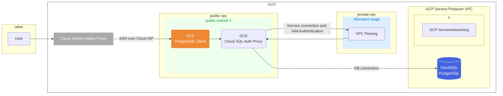

# Terraform GCP Examples

Firstly, we will build CloudSQL and Cloud SQL Auth Proxy, DB Client instance.

## 1. CloudSQL on PrivateSubnet connected from GCE with Cloud SQL Auth Proxy


※ GCPはVPC全体でルートを定義するためパブリックサブネット/プライベートサブネットの区別はない。外部IPアドレスを付与しなければインターネットに疎通できないため、プライベート定義をしたいものには外部IPアドレスを付与しなければよい。  
参考: [Google CloudのVPCを基礎から始める](https://zenn.dev/google_cloud_jp/articles/google-cloud-vpc-101)


# Getting Started

Setting local variables into `terraform.tfvars`
```
cp terraform.tfvars.example terraform.tfvars
vi terraform.tfvars
```

You'll be provisioning Terraform  & deploy
```
terraform init
terraform plan
terraform apply
```

SSH into DB Client
```
gcloud compute ssh --zone "asia-northeast1-a" "db-client" --tunnel-through-iap --project "xxx"
```

Test DB connection
```
psql "host=<CLOUDSQL_AUTH_PROXY_PRIVATE_IP_ADDRESS> port=5432 sslmode=disable dbname=postgres user=postgres"
```

```

```

## Debug
SSH into CloudAuth Proxy
```
gcloud compute ssh --zone "asia-northeast1-a" "cloudsql-proxy" --tunnel-through-iap --project "xxx"
```


# Requirements
- Allow APIs to GoogleCloud Project
  https://console.cloud.google.com/apis/dashboard?project=<YOUR_PROJECT_ID>
  - Compute Engine API
  - Cloud Resource Manager API
  - Service Networking API
  - Cloud SQL Admin API
  - Identity and Access Management (IAM) API
- IAM permissions to notice
  - servicenetworking.services.addPeering
