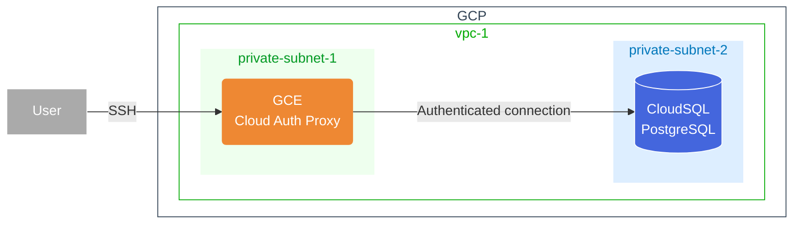

# Terraform GCP Examples

Firstly, we will build CloudSQL on a Private subnet and connected from GCE with Cloud Auth Proxy.

## 1. CloudSQL on PrivateSubnet connected from GCE on vary subnet



# Getting Started

Setting local variables into `terraform.tfvars`
```
vi terraform.tfvars
```

You'll be provisioning Terraform  & deploy
```
terraform init
terraform plan
terraform apply
```
